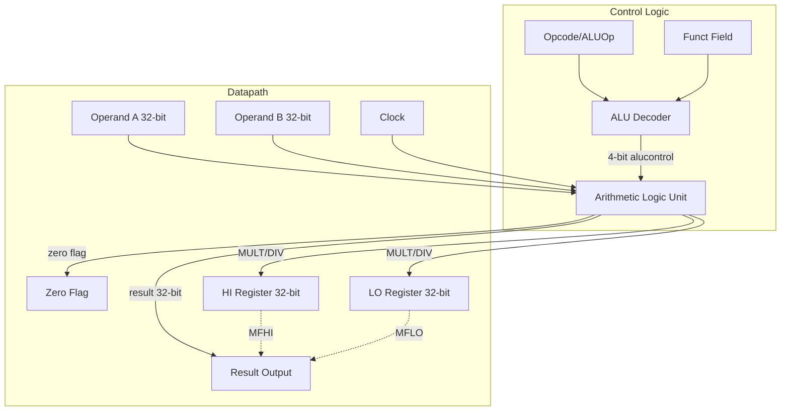

# CPU Architecture Documentation

This document describes the evolving design of the MIPS32 `myCPU` implementation. 

## Phase 1: Single-Cycle Datapath Foundation

### ALU and Control Decoder
The ALU forms the computational heart of the datapath, governed by a 4-bit control signal generated by the ALU Decoder.

#### Software Architecture & Data Flow

### 4-bit ALU Control Mapping

| `alucontrol` | Operation | Corresponding MIPS Instructions |
| :--- | :--- | :--- |
| `0000` | AND | `and` |
| `0001` | OR | `or` |
| `0010` | ADD | `add`, `addi`, `lw`, `sw` |
| `0011` | NOR | `nor` |
| `0100` | MFLO | `mflo` |
| `0101` | MFHI | `mfhi` |
| `0110` | SUB | `sub`, `beq` |
| `0111` | SLT | `slt` |
| `1000` | MULT | `mult` |
| `1001` | DIV | `div` |
