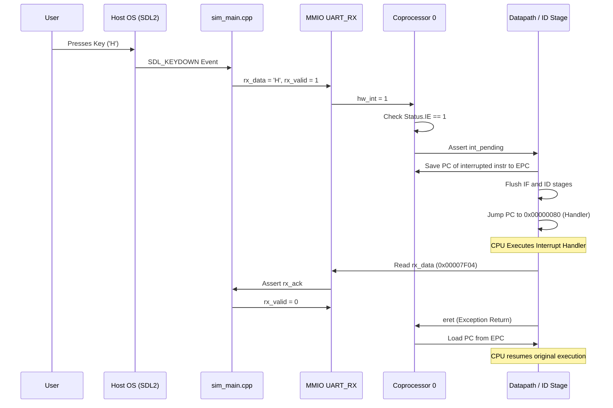
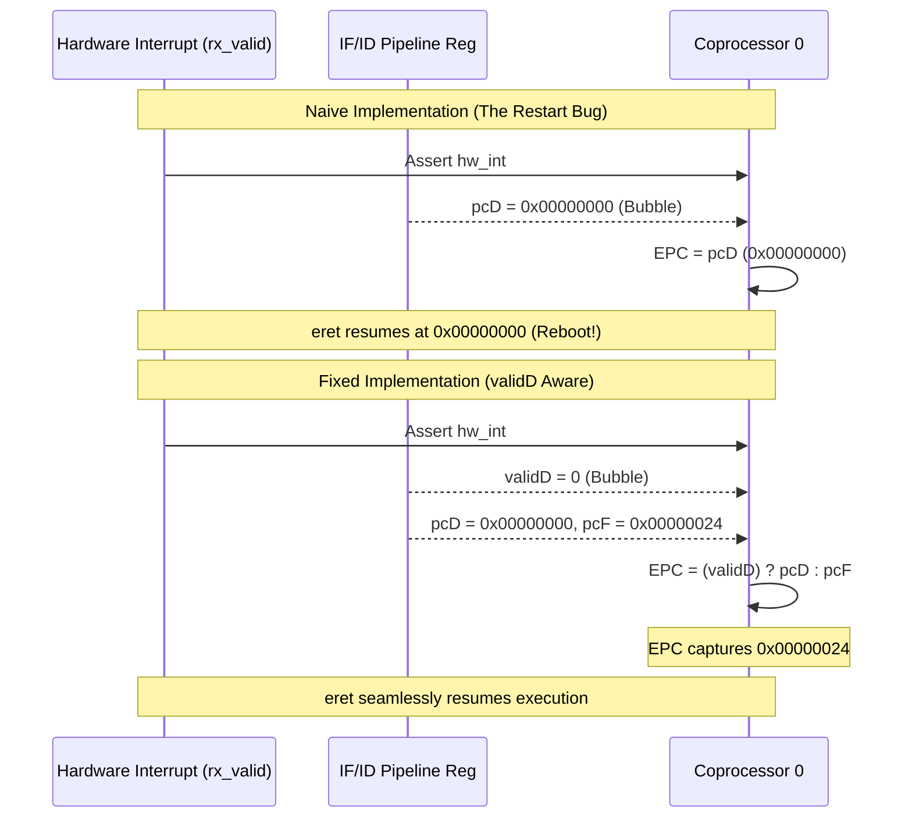

# CPU Architecture Documentation

This document describes the evolving design of the MIPS32 `myCPU` implementation. 

## Pipelined Architecture with Cache, Exceptions, and MMIO

The final implementation is a fully 5-stage pipelined processor featuring an L1 Cache, IEEE-754 FPU, Coprocessor 0 (Exceptions), and Memory-Mapped I/O.

### Full System Architecture Diagram

```mermaid
graph TD
    subgraph CPU Pipeline
        IF[Instruction Fetch] --> ID[Instruction Decode]
        ID --> EX[Execute]
        EX --> MEM[Memory Access]
        MEM --> WB[Writeback]
    end

    subgraph Memory Hierarchy
        L1[L1 Data Cache<br/>64-byte Direct Mapped]
        DRAM[Main Memory<br/>5-Cycle Latency]
    end

    subgraph Peripherals & I/O
        CP0[Coprocessor 0<br/>Status, Cause, EPC]
        UART_TX[UART TX Data<br/>0x00007F0C]
        UART_RX[UART RX Data<br/>0x00007F04]
    end
    
    %% Pipeline Connections
    MEM -->|Data Request| L1
    L1 <-->|Cache Miss Penalty| DRAM
    
    %% MMIO Routing (Bypasses Cache)
    MEM -.->|Write 0x00007F0C| UART_TX
    UART_RX -.->|Read 0x00007F04| MEM
    
    %% Exception/Interrupt Logic
    UART_RX == rx_valid ==>|Asynchronous Interrupt| CP0
    CP0 -.->|int_pending| ID
    CP0 -.->|flush_exc| IF
    CP0 -.->|flush_exc| ID
    CP0 -.->|flush_exc| EX
```

### SDL2 Keyboard Interrupt Sequence

This sequence diagram illustrates how a physical keystroke on the host macOS machine halts the pipelined CPU and executes the interrupt handler.



### 4-bit ALU Control Mapping (Including FPU)

| `alucontrol` | Operation | Corresponding MIPS Instructions |
| :--- | :--- | :--- |
| `0000` | AND | `and` |
| `0001` | OR | `or` |
| `0010` | ADD | `add`, `addi`, `lw`, `sw` |
| `0011` | NOR | `nor` |
| `0100` | MFLO | `mflo` |
| `0101` | MFHI | `mfhi` |
| `0110` | SUB | `sub`, `beq` |
| `0111` | SLT | `slt` |
| `1000` | MULT | `mult` |
| `1001` | DIV | `div` |
| `1010` | SRLV | `srlv` |
| `1100` | MUL.S (FPU)| `mul.s` |
| `1101` | SUB.S (FPU)| `sub.s` |

### The Pipeline Bubble Trap & Asynchronous Interrupts

Handling asynchronous interrupts requires precise capture of the Program Counter to ensure seamless resumption. An edge case exists when an asynchronous interrupt triggers while the pipeline has inserted a "bubble" (e.g., following a branch or jump). 

If the Decode stage holds a bubble, its PC is `0x00000000`. Naively saving the Decode stage PC (`pcD`) into the EPC will cause the CPU to inadvertently reboot to address 0 upon an `eret`.

The solution introduces a `validD` flag. When an instruction is flushed, `validD` is pulled low. If an interrupt fires while `validD == 0`, Coprocessor 0 captures the Fetch stage PC (`pcF`) instead, representing the instruction arriving next cycle.


