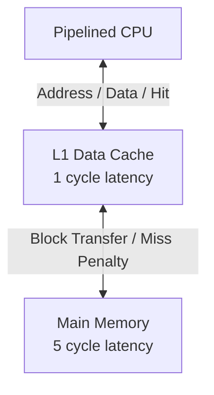

# The Computer Architect's Playbook: Building a CPU from Scratch

Welcome to your journey as a Computer Architect! This guide is written specifically for freshman and sophomore engineering and computer science students. Over the course of this project, you will not just learn *about* computers; you will design and build one from the ground up using SystemVerilog.

We will break down the construction of our MIPS32 processor into manageable "Epics." Roll your sleeves up—here is how we work.

---

## Epic 1: The Basic Components (Datapath & Control)

Before we can build a fully functional Single-Cycle CPU, we need building blocks. Think of this like manufacturing the engine parts before assembling the car. The two most critical parts of any CPU are the **ALU (Arithmetic Logic Unit)** and the **Register File**.

### Step 1: Consult the Specifications (The MIPS Green Sheet)
A Computer Architect never codes blindly. Our contract with the software developers is the **ISA (Instruction Set Architecture)**. 
1. Open the `docs/MIPS_Green_Sheet.pdf`.
2. Look at the **Core Instruction Set**. Notice how different instructions (`add`, `sub`, `and`, `or`) require different mathematical operations. 
3. Look at the **Opcode/Funct** fields. These binary numbers are what the software compiler generates. Our hardware must read these numbers and know exactly what to do.

### Step 2: Design the ALU (`alu.sv`)
The ALU does the actual math. 
*   **The Architect's Task:** We need a module that takes two 32-bit inputs (`a` and `b`), a control signal (`alucontrol`), and outputs a 32-bit `result`.
*   **Implementation:** We use a SystemVerilog `always_comb` block. This creates *combinational logic*—a web of logic gates (AND, OR, XOR) that calculate the answer instantly based on the inputs.
*   **Special Cases (MULT/DIV):** Multiplication and division take time and produce 64-bit results. We must use a clock (`always_ff @(negedge clk)`) to store these results in special registers called `hi` and `lo`.

### Step 3: Design the Decoder (`aludec.sv`)
How does the ALU know to add instead of subtract? The Decoder tells it.
*   **The Architect's Task:** Build a translator. It takes the instruction's `funct` code (like `100000` for ADD) and translates it into a simple 4-bit wire (`alucontrol = 4'b0010`) connected directly to the ALU.

### Step 4: Verification (The Testbench)
An architect's job isn't done when the code compiles; it's done when the hardware is proven flawless.
*   **The Architect's Task:** Write a testbench (`tb_alu.sv`). You must simulate the clock, inject fake inputs (`a=10`, `b=5`), and tell the ALU to add. You then write an `if` statement: *If the result is not 15, throw an error!*
*   **Waveforms:** We use `$dumpfile("tb_alu.vcd")` to generate waveforms. Professional architects spend hours staring at these waveforms to ensure signals arrive at exactly the right nanosecond.

### Step 5: Designing the Register File (`regfile.sv`)
Now that our ALU can calculate, we need a place to store data. In MIPS, we use a **Register File**.
*   **The Architect's Task:** Build a high-speed storage array.
    1.  **Storage:** We need 32 different 32-bit "buckets" (registers).
    2.  **Dual Read Ports:** Most MIPS instructions (like `add $s1, $s2, $s3`) need to read *two* values at once. Our hardware must allow reading from two different addresses simultaneously without waiting for a clock tick (*Asynchronous Read*).
    3.  **Single Write Port:** We only write one result back at a time. This happens only on the "tick" of the clock (*Synchronous Write*).
    4.  **The $zero Rule:** Register 0 is special. In MIPS, it must *always* return 0, no matter what software tries to write to it. As an architect, you implement this by hardcoding the output logic to return `0` if the address is `0`.

### Step 6: The Main Decoder (`maindec.sv`) - The Brain of the CPU
The ALU does the math and the Register File stores the data, but who conducts the orchestra? That is the job of the **Main Decoder**.
*   **The Architect's Task:** Build the master control unit. The CPU fetches a 32-bit instruction from memory. The top 6 bits (bits 31:26) are the **opcode**. The Main Decoder looks *only* at these 6 bits and instantly decides how every other component in the CPU should behave.
*   **Control Signals:** Based on the opcode (e.g., `lw`, `sw`, `beq`, `R-type`), the decoder outputs a combination of 1-bit flags:
    *   `RegWrite`: Should we save data to the Register File?
    *   `RegDst`: Are we writing to the `rd` or `rt` register?
    *   `ALUSrc`: Is the ALU's second input coming from a register (`rt`) or an immediate number?
    *   `Branch` / `Jump`: Are we changing the Program Counter (PC)?
    *   `MemWrite` / `MemToReg`: Are we interacting with Data Memory?
    *   **ALUOp**: A 2-bit code passed to the *ALU Decoder* (which we built in Step 3) to finalize the exact math operation.
    *   **Implementation:** We use an `always_comb` block with a `case(opcode)` statement to flip these control flags on or off like a switchboard.

    ### Step 7: The Sign Extender (`signext.sv`)
    Some MIPS instructions contain immediate numbers built right into the instruction code (like `addi $t0, $t1, -5`). 
    *   **The Architect's Task:** A MIPS instruction is exactly 32 bits wide. In an I-type instruction, the opcode, registers, and other data take up the top 16 bits, leaving exactly 16 bits for the immediate number. However, our ALU only accepts 32-bit inputs!
    *   **The Problem:** We cannot simply pad the front of a negative number with zeros. The 16-bit binary for `-1` is `1111111111111111`. If we pad it with zeros, it becomes `00000000000000001111111111111111`, which is the positive number `65535`!
    *   **Implementation:** To convert a 16-bit number to a 32-bit number while preserving its sign (positive or negative), we must perform **Sign Extension**. We look at the Most Significant Bit (MSB, which is bit 15) of the 16-bit input. We then copy that exact bit into the top 16 bits of our new 32-bit output. We can do this cleanly in SystemVerilog using the replication operator: `{{16{a[15]}}, a}`.

    ---

### Next Steps for You:
In our next lesson, we will build the **Register File** (`regfile.sv`). Prepare by looking at the MIPS Green Sheet: How many registers are there? How wide are they? What is special about Register `$zero`?
# Epic 2: The Memory Subsystem and Top-Level Wiring

Welcome back, architects. We have built the engine (ALU), the switchboard (Decoder), the storage (Register File), and the adapter (Sign Extender). Now, we must build the fuel tank (Memory) and wire the entire system together to create our first fully functional **Single-Cycle CPU**.

### Step 8: Instruction & Data Memory (`imem.sv` and `dmem.sv`)
A computer must fetch instructions to execute and read/write data. In this Single-Cycle model, we use a **Harvard Architecture**, meaning we separate the memories so we can fetch an instruction and read/write data in the exact same clock tick.
*   **The Architect's Task:** 
    1.  **Instruction Memory (ROM):** Build a read-only memory. It takes a 32-bit address (the Program Counter) and instantly outputs the 32-bit instruction. Because MIPS memory is *byte-addressable* but instructions are *word-aligned* (32 bits = 4 bytes), we must shift the address right by 2 (divide by 4) to access the correct 32-bit word in our array.
    2.  **Data Memory (RAM):** Build a memory that can both read and write. It reads combinationally (instantly) but writes synchronously (on the clock edge, only if `we` is high).
*   **Initialization:** To test our CPU, we must load a program. We use the SystemVerilog `$readmemh` function to load a hexadecimal machine code file (`memfile.dat`) directly into our memory arrays when the simulation starts.

### Step 9: The Program Counter (`dff.sv`)
The Program Counter (PC) is the heartbeat of the CPU. It tells the Instruction Memory exactly which instruction to fetch next.
*   **The Architect's Task:** Build a 32-bit D-Flip-Flop (DFF) with an asynchronous reset. 
    *   On every rising clock edge, it updates the PC to the new address.
    *   When the system is reset, it forces the PC to `0x00000000` so the computer starts executing from the very beginning.

### Step 10: The Datapath (`datapath.sv`)
Now, we act as the electricians. The Datapath wrapper module takes all the basic components we built in Epic 1 and wires them together.
*   **The Architect's Task:** 
    *   Instantiate the ALU, Register File, Sign Extender, and PC.
    *   Connect them using internal wires (`logic [31:0]`).
    *   We need multiplexers (`mux2.sv`) to route signals based on the Control Unit. For example, a mux decides if the ALU's second input is a Register (`B`) or the Sign Extended Immediate, based on the `ALUSrc` control signal.
    *   We also build the **Branch Logic**: calculating `PC + 4` and adding the shifted immediate to compute the branch target.

### Step 11: The CPU and Computer (`cpu.sv` and `computer.sv`)
Finally, we put the processor in the motherboard.
*   **The Architect's Task:** 
    1.  **`cpu.sv`:** Combine the Datapath module and the Control Unit modules (`maindec`, `aludec`). This is the complete processor chip.
    2.  **`computer.sv`:** Instantiate the CPU, the Instruction Memory, and the Data Memory. Wire the CPU's PC to the Instruction Memory, and the CPU's ALU Result to the Data Memory's Address port. 
*   **The Final Test:** Once this is done, our machine will finally run real software!

---# Epic 3: The Multi-Cycle Architecture

Welcome to Phase 2. We have successfully built a Single-Cycle CPU. It is simple and easy to understand, but it has two massive flaws:
1. **The Clock is Too Slow:** The clock cycle must be long enough for the slowest instruction (like `lw`) to travel through the entire chip (IMEM -> Register File -> ALU -> DMEM -> Register File). Fast instructions (like `add`) waste time waiting for the clock to tick.
2. **Wasted Hardware:** Because everything happens in one tick, we cannot reuse hardware. We had to build two separate memories (Instruction and Data) and multiple adders (for PC + 4 and Branching).

To solve this, we move to a **Multi-Cycle Architecture**.

### Step 12: The Von Neumann Shift
Instead of doing everything at once, we break instructions down into 3 to 5 smaller steps. We will execute one step per clock cycle. 
*   **The Architect's Task:** 
    *   **Unified Memory:** Since we fetch the instruction in Step 1 and read data in Step 4, we no longer need separate memories! We will combine `imem` and `dmem` into a single `mem.sv`.
    *   **Shared ALU:** We can use the main ALU to calculate `PC + 4` in Step 1, and do mathematical operations in Step 3. We no longer need separate adders.
    *   **State Registers:** Because an instruction takes multiple cycles, we need "save points" between steps. We must build non-architectural state registers (Instruction Register `IR`, Memory Data Register `MDR`, `A`, `B`, and `ALUOut`).

### Step 13: The Finite State Machine (FSM)
In the Single-Cycle CPU, the Main Decoder was a simple combinational translator. In the Multi-Cycle CPU, the Control Unit must be a **Finite State Machine**.
*   **The Architect's Task:** Build `controller.sv`.
    *   It will have a `state` variable (e.g., FETCH, DECODE, EXECUTE, MEM_WRITE, WRITEBACK).
    *   On every clock tick, it moves to the next logical state.
    *   The control signals (`ALUSrcA`, `ALUSrcB`, `MemWrite`, etc.) will change depending on *both* the current instruction opcode AND the current state of the FSM. 
    *   This is the most complex control logic you will build. You must carefully map the state transitions exactly as shown in the Harris & Harris state diagram.

### Step 14: Implementing the Controller (`controller.sv` and `mainfsm.sv`)
To keep our code organized, we split the FSM into two parts: the overall `controller` (which also handles ALU decoding, just like in the Single-Cycle) and the `mainfsm` (which handles the state transitions).
*   **The Architect's Task:**
    1.  **State Definition:** In SystemVerilog, we use `typedef enum logic [3:0]` to explicitly name our states (e.g., `FETCH`, `DECODE`, `MEMADR`). This makes the code highly readable and prevents "magic number" errors.
    2.  **Next State Logic:** We use an `always_comb` block to look at our `state` and the instruction `op` to determine what the `nextstate` should be. (e.g., if we are in `DECODE` and the opcode is `lw`, the next state is `MEMADR`).
    3.  **State Memory:** A simple `always_ff @(posedge clk)` block updates `state <= nextstate`.
    4.  **Output Logic:** Another `always_comb` block looks at the current `state` and sets all the control wires (like `IRWrite` to save the instruction, or setting `ALUSrcB` to `2'b01` to add 4 to the PC during `FETCH`).

### Step 15: Wiring the Multi-Cycle Datapath (`datapath.sv`)
Now we assemble the physical components. Because we are reusing the ALU and Memory across different clock cycles, our plumbing requires more multiplexers and state registers.
*   **The Architect's Task:**
    1.  **Shared Memory:** Notice we only instantiate one `mem.sv`. We use a multiplexer (`IorD`) to choose whether the memory address comes from the `PC` (during FETCH) or `ALUOut` (during Data Memory Access).
    2.  **State Registers:** Since data arrives at different times, we must catch it and hold it.
        *   When we read an instruction from memory, we catch it in the `IR` (Instruction Register). It only updates when `IRWrite` is high.
        *   When we read data from memory, we catch it in the `MDR` (Memory Data Register).
        *   When we read from the Register File, we catch the two values in registers `A` and `B`.
        *   When the ALU calculates a result, we catch it in `ALUOut`.
    3.  **Shared ALU:** The ALU is now the hardest working component. During FETCH, we use it to add `PC + 4`. During DECODE, we use it to calculate the branch target address. During EXECUTE, we finally do the math requested by the instruction. We route the correct inputs to the ALU using large `mux4` (4-to-1) multiplexers, controlled by `ALUSrcA` and `ALUSrcB`.

---# Epic 4: The 5-Stage Pipelined Architecture

Welcome to Phase 3. The Multi-Cycle CPU solved our hardware duplication problem, but it is still slow: it executes one instruction every 3 to 5 clock cycles (CPI > 1). 

Modern processors use an **Assembly Line** technique called **Pipelining**. Instead of waiting for a car to be fully built before starting the next one, we move the car down the line. We divide the CPU into 5 distinct stages:
1. **Instruction Fetch (IF)**
2. **Instruction Decode (ID)**
3. **Execute (EX)**
4. **Memory Access (MEM)**
5. **Writeback (WB)**

With this design, we can finish 1 instruction every single clock cycle (CPI = 1)! But it introduces incredibly complex traffic jams known as **Hazards**.

### Step 16: Pipeline Registers
To keep the instructions from crashing into each other, we must put walls between the stages.
*   **The Architect's Task:** We will build Pipeline Boundary Registers (`IF/ID`, `ID/EX`, `EX/MEM`, `MEM/WB`). These are massive flip-flops that hold not just the data, but *all the control signals* for that specific instruction. As the instruction moves down the pipeline, its control signals ride alongside it.
*   **Clear and Enable:** We will need special flip-flops (`flopenrc.sv`) that have both an `Enable` (to pause or stall the pipeline) and a `Clear` (to flush the pipeline).

### Step 17: Data Hazards and Forwarding (Bypassing)
What happens if instruction 1 calculates `$t0`, and instruction 2 immediately tries to read `$t0`? Instruction 1 hasn't reached the Writeback stage yet! This is a **Read-After-Write (RAW) Data Hazard**.
*   **The Architect's Task:** We cannot afford to wait. We must build a **Hazard Unit**. 
*   **Forwarding Logic:** The Hazard Unit will look ahead. If it sees that the EX stage needs a register that the MEM or WB stage is currently holding, it will trigger a Multiplexer to "time travel" the data backward. This is called **Bypassing** or **Forwarding**.

### Step 18: Control Hazards, Stalls, and Flushes
Sometimes, forwarding isn't enough.
*   **The Load-Use Hazard:** If instruction 1 is `lw $t0` and instruction 2 needs `$t0`, the data doesn't exist until the end of the MEM stage. We *must* pause the pipeline. The Hazard Unit will freeze the PC and IF/ID registers, injecting a "bubble" (a `NOP` instruction) into the EX stage. This is called a **Stall**.
*   **The Branch Hazard:** If instruction 1 is a `beq` (branch), we won't know if we are jumping until the Decode or Execute stage! But by then, we've already fetched the wrong instructions! 
*   **The Architect's Task:** If a branch is taken, the Hazard Unit must assert the `Clear` signal on the Pipeline Registers, wiping out the mistakenly fetched instructions. This is called a **Flush**.

---# Epic 5: Cache Memory & System Integration

Welcome to Phase 4. We have a highly optimized 5-Stage Pipelined CPU executing one instruction per clock cycle. However, this assumes our Data Memory is magically instantaneous. In reality, Main Memory (RAM) is extremely slow—taking 10 to 100 clock cycles to respond. If we hook our CPU directly to slow RAM, the pipeline will stall on *every* `lw` and `sw`, destroying our performance!

To solve this, we introduce the **Memory Hierarchy** and the **L1 Cache**.

### Step 19: The Performance Baseline (No Cache)
First, we must understand the problem.
*   **The Architect's Task:** We will replace our instantaneous `dmem.sv` with `main_memory.sv`, which simulates a 5-cycle read/write latency using a simple state machine and handshake signals (`mem_valid`, `mem_ready`).
*   **Global Stalls:** We must modify our Pipeline Control. If `mem_ready` is 0 during a Memory stage access, the *entire* pipeline must freeze. 
*   **Testing:** We wrote an assembly program `programs/cache_test.asm` that loops through an array, storing 16 values, then loops through again to sum them. If we run this on the "No Cache" baseline, every memory access forces a 5-cycle stall, resulting in terrible performance.

### Step 20: The L1 Direct-Mapped Cache
We will build a small, blindingly fast memory that sits exactly between the CPU and Main Memory.
*   **Locality:** Caches work because of *Temporal Locality* (if you use data, you'll likely use it again soon) and *Spatial Locality* (if you use data, you'll likely use the data next to it).
*   **The Architect's Task:** Build `l1_cache.sv`.
    *   **Structure:** We will build a Direct-Mapped Cache. Each cache line (block) will hold 4 words. 
    *   **Address Splitting:** The 32-bit physical address from the CPU is split into three parts: `Tag`, `Index` (which line in the cache), and `Offset` (which word in the line).
*   **Cache Controller (`cache_controller.sv`):** 
    *   When the CPU requests an address, the controller checks if the `Tag` matches and the `Valid` bit is 1. If yes: **CACHE HIT!** The data is returned in 1 cycle.
    *   If no: **CACHE MISS!** The controller asserts `cpu_stall`, requests the entire 4-word block from Main Memory (taking many cycles), writes it into the cache line, and then drops the stall so the CPU can finally read the word.

By running `cache_test.asm` *with* the cache, we will see Compulsory Misses during the first loop, but **100% Cache Hits** during the second loop, drastically reducing the total cycle count!

---
### Step 21: Quantifying the Cache Advantage
As an architect, your design decisions must be backed by data. We ran our array summation program (`cache_test.asm`) through both configurations.
*   **The Baseline (No Cache):** The program executed 184 dynamic instructions. Because every one of the 33 memory accesses incurred a 4-cycle stall penalty, the total execution time was **369 cycles**. This gives us a baseline CPI of **2.00**.
*   **The L1 Cache Configuration:** We introduced a 64-byte Direct-Mapped Cache with 16-byte blocks. By loading 4 words at a time, we leveraged spatial locality. The program executed the same 184 instructions, but the execution time plummeted to **325 cycles**.
*   **The Math:** Why exactly 325 cycles? 
    *   12 of the 16 array loads became **Cache Hits** (0 stall cycles), saving us 48 stall cycles.
    *   The 4 **Compulsory Misses** triggered our Cache Controller FSM, adding a slight overhead of 1 extra cycle per miss (-4 cycles).
    *   369 baseline - 48 saved + 4 overhead = **325 cycles**. 
    *   Our CPI dropped from 2.00 to **1.76**, a 12% performance increase from a trivially simple Cache implementation!

---
