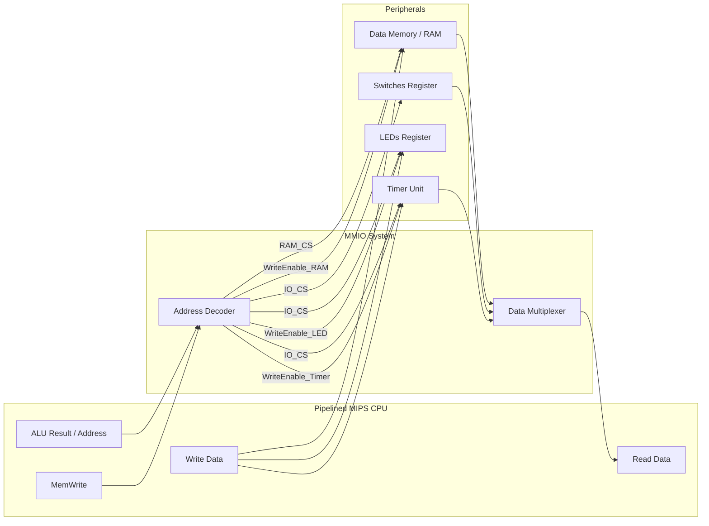

# Memory-Mapped I/O (MMIO) Architectural Design

In the MIPS architecture, communication with the outside world—such as sensors, switches, and displays—is handled through **Memory-Mapped I/O (MMIO)**. This design treats hardware peripherals as if they were memory locations. Instead of using specialized "Input/Output" instructions, the CPU uses standard load (`lw`) and store (`sw`) instructions to interact with these devices.

This document serves as the architectural specification for the MMIO subsystem of the `myCPU` pedagogical processor.

---

## 1. Address Space Partitioning

To ensure the CPU can distinguish between a request for internal Data RAM and a request for an external peripheral, we partition the 32-bit physical address space. For this implementation, we use a simple **High-Bit Partitioning** strategy:

| Address Range | Device | Capacity / Notes |
| :--- | :--- | :--- |
| `0x0000_0000` – `0x0000_FFFF` | **Data RAM** | 64 KB Internal Memory |
| `0x0001_0000` – `0x0001_FFFF` | **I/O Peripherals** | Peripheral Register Space |
| `0x0002_0000` – `0xFFFF_FFFF` | *Reserved* | Future Expansion |

### Why Partition This Way?
By using the 16th bit (bit 16) of the address as a "boundary marker," the hardware decoder can be implemented with extremely low latency. If bit 16 is `0`, the CPU is talking to RAM. If bit 16 is `1`, it is talking to the I/O bus.

---

## 2. The Address Decoder

The **Address Decoder** is a combinational logic block situated between the CPU's Memory Stage and the physical devices. It monitors the `DataAddr` and `MemWrite` signals from the CPU to determine which device should be "activated."

### Control Logic Signals
The decoder generates **Chip Select (CS)** signals for each device:
*   **`RAM_CS`**: Asserted when the address is in the `0x0000_XXXX` range.
*   **`IO_CS`**: Asserted when the address is in the `0x0001_XXXX` range.

### Bus Multiplexing
When the CPU performs a `lw` (Load Word), the Address Decoder also acts as a multiplexer for the `ReadData` bus. It selects whether the data returned to the CPU comes from the RAM's output or from a specific peripheral register, based on the address.

---

## 3. Peripheral Memory Mappings

Each peripheral is assigned a specific "Register Address." These registers are 32 bits wide to align with the MIPS word size.

### A. Switches (Input)
*   **Address:** `0x0001_0000`
*   **Behavior:** **Read-Only**.
*   **Description:** Reading from this address returns the current state of the 32 physical switches on the FPGA board or simulator. Writing to this address has no effect.

### B. LEDs (Output)
*   **Address:** `0x0001_0004`
*   **Behavior:** **Write-Only**.
*   **Description:** Writing a 32-bit value to this address updates the physical LED array. A `1` in a bit position turns the corresponding LED ON; a `0` turns it OFF. Reading from this address returns the last value written.

### C. Timer / Counter (R/W Control)
The Timer peripheral allows software to measure real-time intervals by counting clock cycles.
*   **Timer Data Register (`0x0001_0010`):** 
    *   **Read:** Returns the current value of the internal 32-bit counter.
    *   **Write:** Resets or presets the counter to a specific value.
*   **Timer Control Register (`0x0001_0014`):**
    *   **Bit 0 (Enable):** Set to `1` to start the counter, `0` to pause.
    *   **Bit 1 (Interrupt):** If set to `1`, the timer will trigger a CPU interrupt when it reaches a specific threshold (future implementation).

---

## 4. Architecture Diagram

The following diagram illustrates how the Pipelined CPU interacts with the Memory System and Peripherals via the MMIO Decoder.



---

## 5. Summary for Students

When writing MIPS assembly for this system:
1.  To turn on the first LED, use:
    ```assembly
    li $t0, 0x00010004  # Load LED address
    li $t1, 1           # Value to turn on LED 0
    sw $t1, 0($t0)      # Store to MMIO
    ```
2.  To read the switches:
    ```assembly
    li $t0, 0x00010000  # Load Switch address
    lw $s0, 0($t0)      # Load from MMIO to $s0
    ```

This abstraction allows your software to interact with complex hardware using the same logic used to manage variables in memory.
